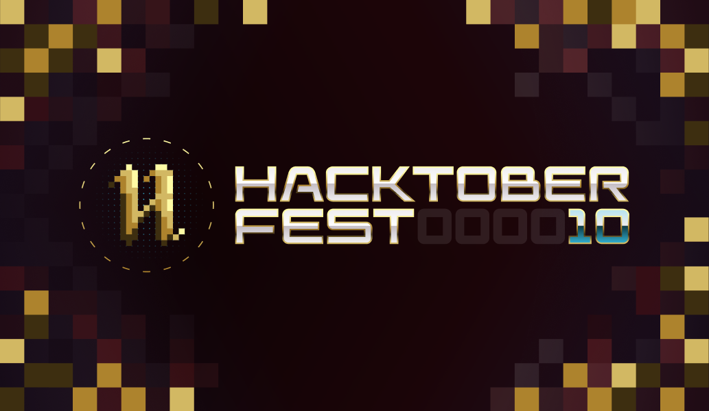

# Course Manager

 

Course Manager is an open-source platform designed to provide a comprehensive and user-friendly solution for individuals seeking to enhance their programming skills. Whether you're a beginner looking to start your coding journey or an experienced developer aiming to broaden your knowledge, Course Manager offers a versatile environment for learning and growth.

## Key Features:

- **Diverse Course Catalog:** Explore a wide range of programming courses, from introductory tutorials to advanced topics, carefully curated to cater to learners of all levels.

- **Free and Premium Options:** Choose from a selection of both free and premium courses. While free courses offer essential content, premium courses provide in-depth insights and additional resources for those who are willing to invest in their learning.

- **User-Friendly Interface:** Navigate through the platform effortlessly with an intuitive and easy-to-use interface. Enroll in courses, track progress, and access course materials with just a few clicks.

- **Interactive Learning:** Engage with interactive quizzes, assignments, and coding exercises to reinforce your understanding and apply your skills in real-world scenarios.

- **Community Interaction:** Connect with a vibrant community of learners, ask questions, share insights, and collaborate on projects to foster a supportive learning environment.

- **Certifications and Badges:** Earn certificates and badges upon completing courses, showcasing your achievements to potential employers or fellow developers.

## Hacktoberfest 2023

This repository is participating in Hacktoberfest 2023. If you are new to Hacktoberfest or open source in general, please refer to the [Hacktoberfest website](https://hacktoberfest.com/) for more information.

## Why Course Manager?

**Accessible Learning:** We believe in making quality programming education accessible to everyone. With a mix of free and premium options, Course Manager ensures that learning valuable programming skills doesn't have to be a financial burden.

**Continuous Growth:** Stay up-to-date with the latest technologies and trends in the ever-evolving programming landscape. Our course catalog is regularly updated to reflect industry advancements.

**Learning Flexibility:** Tailor your learning journey to your schedule and preferences. Study at your own pace, revisit course materials as needed, and explore new topics of interest.

Whether you're looking to kickstart your coding career, level up your programming abilities, or explore new horizons in the tech world, Course Manager is your partner in the quest for knowledge. Join our thriving community of learners today and embark on an exciting journey of programming excellence.

## Our Discord
🌐 **Join Us Today:**
Help us improve online learning and be part of something bigger this Hacktoberfest! Join our community on Discord: [https://discord.gg/xbEPyR3U8e] and let's make a difference together.

